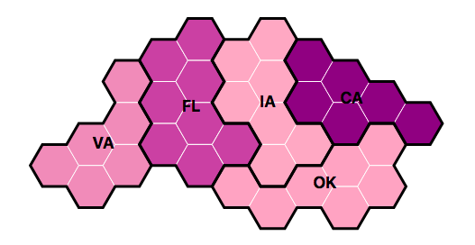
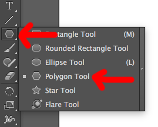
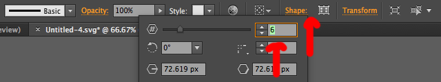
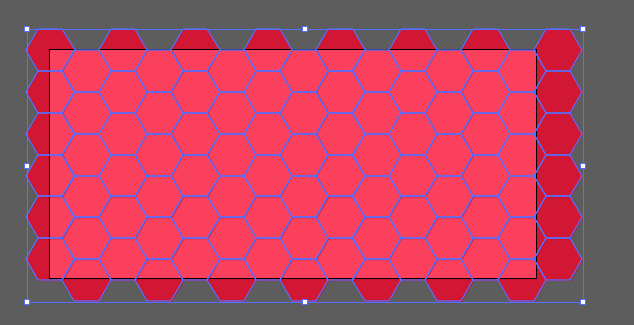
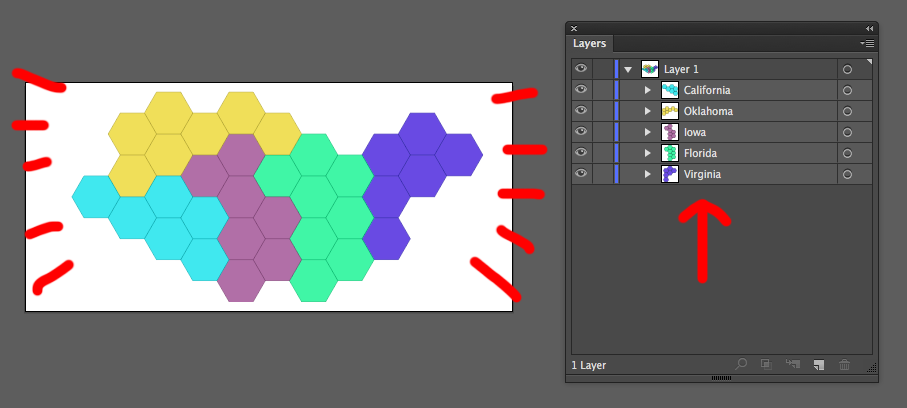

# Hex Grid Script for Adobe Illustrator

This makes repeating hexagonal grids for hex maps or heat maps or Dungeons and Dragons or whatever you want. There are [tools like this](https://pitchinteractiveinc.github.io/tilegrams/) but I'm too lazy to read the documentation for them. And hey, we like to use Illustrator to customize our stuff, right?



See a demo of hex grids using d3 and turf.js [right here](http://jsoma.github.io/hexagon-grids-for-adobe-illustrator/)

## Usage

### Step 1. Drawing the template hexagon

Draw a hexagon of the proper size using the Polygon tool (it's under shapes). Hold shift while you draw to keep your hexagon the right proportion!



> If you'd like to rotate your hexagon to make the pointy side point up, select your hexagon and use **Object > Transform > Rotate**. Pick **90** as your rotation amount.



If your hexagon has too many sides, use the **Shapes** menu to kick it up/down to 6.


### Step 2. Running the script

1. Save [hex-grid-generator.js](https://github.com/jsoma/hexagon-grids-for-adobe-illustrator/raw/master/hex-grid-generator.js) to your machine.
2. Using the Selection Tool, **select the hexagon.** *Just one hexagon!*
3. Now you can **run the script** by selecting **File > Scripts > Other Scripts...** and picking the `.js` file from wherever you downloaded it to.



Tada! If you'd like to install it as a permanent script, see the instructions at the bottom of the page.

### Step 3. Putting things in groups

If you want to put things into groups (which maybe you do, it helps for coloring and organizing), here's how I suggest doing it:

1. Select a series of hexagons: either hold shift and click to select multiples, or use the lasso tool and then press `V`. I like the lasso technique, but it can be finnicky.
2. Change the color, and press `Ctrl+G` to place the hexagons into a group together.
3. Repeat until you've put everything in a hex (or deleted the additional ones)
4. Double-click each layer name to give it a name - no spaces, please! If you don't have the Layer panel, **Window > Layers** will reveal it.



### Step 4. Using it in D3 (totes optional, of course)

I'm using this to build hex-based cartograms in D3, because it seems nice to have control over my shapes! If you'd like to do the same, **save your file as an SVG**.

Maybe you have a CSV file full of data to associate with each group of hexagons? Make sure you have a column that matches with your **layer names**. In this case, `state` is the same as the layer name.

```
state,population
California,39.5
Oklahoma,3.93
Iowa,3.14
Florida,20.98
Virginia,8.47
```

Now let's get the D3 part going:

* Read in your SVG using `d3.xml`, call it `hexFile`.
* Read in your CSV using `d3.csv`, call it `datapoints`

To associate your CSV data with your svg file, you need to do some really weird trickery. The positive side is that if you steal this code, you'll only ever have to change `d.state` to match your CSV column name.

```js
// Take the read-in file, pull the SVG contents out of it
let imported = d3.select(hexFile).select('svg')

// Get rid of the stylesheets, we can ignore those
imported.selectAll('style').remove()

// Fill up our own graphic with the contents of the imported svg
svg.html(imported.html())

// Loop through our data, finding the groups for each
// state. Use d3 to attach our data to each of those groups.
datapoints.forEach(d => {
  svg.selectAll("#" + d.abbr)
    .attr('class', 'hex-group')
    .each(function() {
      d3.select(this).datum(d)
    })
})
```

Once you've done that you can easily use your color scale or whatever on the hexagons - just loop through the group and find the polygons inside!

```js
svg.selectAll('.hex-group')
  .each(function(d) {
    var group = d3.select(this)
    group.selectAll('polygon')
      .attr('fill', colorScale(d.population))
  })
```

What does that even look like? Look at [a demo](http://jsoma.github.io/hex-grids-for-adobe-illustrator).

> Yes, you can also associate your data with the hexagons themselves so you don't have to do the `.each` thing. If you want to draw outlines and stuff, though, this technique works a lot better.

## Installation instructions

You can just download it and use it like the above, but if you'd like to have it forever and ever, install instructions to make it show up in the Scripts menu...

**Windows**

You'll install it in something that looks like `C:\Program Files\Adobe\Adobe Illustrator CC 2018\Presets\en_US\Scripts`. It might be in `Adobe Illustrator CS6 (64 Bit)` or something else like that, and your language might be `en_GB` or `de_DE` or whatever if you aren't an American, but I trust that you can figure it out.

**OS X**

You should follow [these instructions](https://xinrongding.wordpress.com/2015/12/21/illustrator-cc-install-scripts-on-mac-os/), they're really good and even have screenshots!

> Writing code in the ExtendScript Toolkit seriously broke me. I promise I know how to write JavaScript, really.